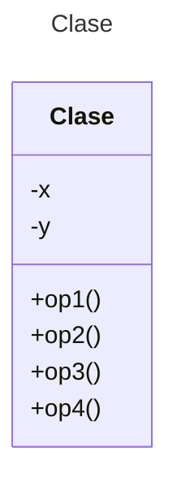

# Proyecto - Java con Pruebas para Autograding - Maven

Plantilla básica para proyecto de Java con Autograding usando Maven

## Diagrama de clases
[Editor en línea](https://mermaid.live/)

[Referencia-Mermaid](https://mermaid.js.org/syntax/classDiagram.html)

## Diagrama de clases UML con draw.io
El repositorio está configurado para crear Diagramas de clases UML con ```draw.io```. Para usarlo das doble clic sobre el archivo ```uml.class.drawio.png```. Asegúrate de agregar las formas UML en el menú de formas del lado izquierdo (opción ```+Más formas```).

### Prompts para generar los Diagramas de Clase y Secuencia con MermAId

Para mejores resultados agrega primero como contexto las clases del proyecto y después aplica los prompts.

```
@mermaid /uml
@mermaid /sequence
```
## Versión de Java

Verifica que tengas la versión adecuada de Java para trabajar con Maven. En caso de requerir una versión especial, usa los siguientes comandos.

### Verificar versión actual
```
java --version
```
### Verificar versiones disponibles para instalar
```
sdk list java
```
### Instalar la última versión
```
sdk install java
```
### Instalar una versión específica
```
sdk install java xxx-version
```
Ejemplo:
```
sdk install java 17.0.18-ms
```
## Uso del proyecto con Maven

### Compilar
```
mvn compile
```
### Probar N tests
```
mvn test
```
### Probar 1 test
```
mvn test -Dtest="AppTest#shouldAnswerWithTrue" 
```
### Ejecutar App
```
mvn -q exec:java
```
```
java -cp target/classes miPrincipal.App
```
### Empacar App
```
mvn package
```
### Limpiar binarios
```
mvn clean
```
## Comandos Git-Cambios y envío a Autograding

### Por cada cambio importante que haga, actualice su historia usando los comandos:
```
git add .
git commit -m "Descripción del cambio"
```
### Envíe sus actualizaciones a GitHub para Autograding con el comando:
```
git push origin main
```
